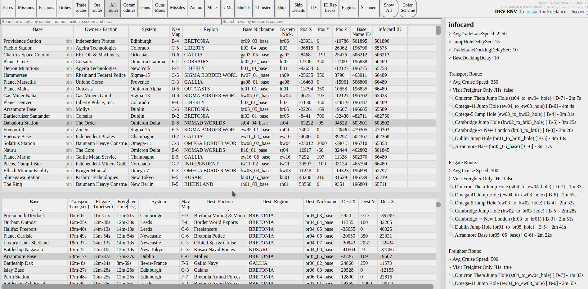

# Description

online version of the [flstat](https://discoverygc.com/forums/showthread.php?tid=115254) to navigate game data of [the game Freelancer](https://youtu.be/RHlH_qOH5zc). You can see data about Bases, Guns, Ships and multiple other stuff.

It is able to work in two mods:
- Static Site Generator to build html/css/js files to deploy them for example to github pages (In this way runs for Freelancer Vanilla and FLSR)
- Live web backend for more nearly real time update of content (useful for Discovery). Cached behind CDN to run smmothly

See demos:

- [Staging version](https://darklab8.github.io/fl-darkstat/)
- [Freelancer Discovery version](https://darklab8.github.io/fl-data-discovery/) [(action)](https://github.com/darklab8/fl-data-discovery/actions/workflows/publish.yaml)
  - [Discovery As Backend version](https://darkstat.dd84ai.com/)
- [Freelancer Vanilla version](https://darklab8.github.io/fl-data-vanilla/) [(action)](https://github.com/darklab8/fl-data-vanilla/actions/workflows/publish.yaml)
  - [Vanilla as Backend version](https://darkstat-vanilla.dd84ai.com/)
- [Freelancer Sirius Revival](https://darklab8.github.io/fl-data-flsr/) [(action)](https://github.com/darklab8/fl-data-flsr/actions/workflows/publish.yaml)

# Contains sub projects

- [darkcore Readme](./darkcore/README.md) - reusable web part for freelancer related web tools. We can say it is filling same niche as "Framework" in normal projects.
- darkrelay - subproject to make darkstat having dynamic backend, which helps to break limitations of a static site generator which darkstat originally started as.
- configs - ORM library to access configs data.

# Support

- It was made in mind with supporting [Freelancer Discovery](https://discoverygc.com/) as first order.
- Support is extended to Vanilla version.
- Any other mode will be supported on request, see contacts to get in touch.

# Development setup

The project assumes
- u are working with it through VSCode IDE, and having installed [Go extension](https://marketplace.visualstudio.com/items?itemName=golang.Go)
- And having [templ extension](https://templ.guide/developer-tools/ide-support/#visual-studio-code)
  - Optionally u are able to use any other supported IDE there, as instructions are provided for more of them. See https://templ.guide/developer-tools/ide-support for other supported IDEs.
- we use VScode's way to inject env var `"ENVERANT_ENV_FILE": "${workspaceFolder}/.vscode/enverant.json"` in terminal, debugging and test running configurations in order to see all dev env variables specified in [enverant.json file](./.vscode/enverant.json)
- Your var `CONFIGS_FREELANCER_FOLDER` must point to existing root of a Freelancer game. Which can be Freelancer Vanilla, Discovery or FLSR at this point.
- Succesful configuration IDE assumes u are able to run in debug mode prject in `web` mode at least as it is specified in [launch.json](./.vscode/launch.json)
  - And u are able to launch specific unit tests in debug mode by clicking in IDE onto green appeared arrows at the left from test function names. Vscode uses `"go.testEnvVars"` in [settings.json](./.vscode/settings.json) to inject the same enverant.json for the functioning of tests.

General instruction:
- git clone the repo https://github.com/darklab8/fl-darkstat.git
- install golang of project version or higher (potentially will work anyway).
  - See current golang version [in Dockerfile](./Dockerfile)
- install [templ](https://templ.guide/quick-start/installation)
  - go install github.com/a-h/templ/cmd/templ@latest
  - check specific version in [go.mod](./go.mod)
  - In case of emergency we could use vendored in version perhaps
- check [environment variables to set](.vscode/enverant.json)
  - set your own environment variable FREELANCER_FOLDER to Freelancer Folder
  - ensure it was set. `echo $FREELANCER_FOLDER` at Linux or `echo %FREELANCER_FOLDER%` at windows
    - optionally is enough to change value in [enverant.json](.vscode/enverant.json) for that
  - Check to have set other values from [enverant.json](.vscode/enverant.json)
  - full list of variable possible to set available in help command `go run . help`
- install [Taskfile](https://taskfile.dev/usage/) and check [commands to run](Taskfile.yml)
  - run some command, for example `task web`
- if u wish access to `task dev:watch` that reloads running web server on file changes, then install `pip install watchdog[watchmedo]` and ensure `watchmedo` binary is available to `task dev:watch` command written [in Taskfile](Taskfile.yml)

If u have problems with configuring development environment, then seek my contacts below to help you through it ^_^

# Development, how to regenerate proto related code

- task grpc:docker:gateway // for docker way to run file updates for grpc and its gateway // assumes docker is available of unix socket
- task grpc:protoc:gateway // to run grpc file updates locally without docker. // assumes u did same stuff as `protoc` stage in Dockerfile

# Features

- Long term maintance support for dozen of years. Minimum dependencies software with Golang and Htmx.
- full GitOps. On commit push to redeploy it automatically
  - See example in [fl-data-discovery repo](https://github.com/darklab8/fl-data-discovery). It contains .github/workflows + game data
- scans Freelancer folder and builds to static assets (html/css/js) deployable to Github pages or any other static assets serving place.
- Usable locally for Linux and Windows.
- Cross mod support is available
  - Freelancer Discovery
  - Vanilla Freelancer
  - Freelancer Sirius Revival
  - may be will working for any other mod, if not, then request support

# Darkstat has API access

# JSON rest one, with swagger documentation

- API has swagger documentation accessable from its interface by button "API" at the top of menu
  - It is available only for Static Binary and Dockerized deployments currently.
  - It is known to run in production for Freelancer Discovery, [check here](https://darkstat.dd84ai.com/swagger/index.html)
  - accessable locally over https://localhost:8000, or optionally unix socket `/tmp/darkstat/http.sock` for extra performance boosts.
  - deployed Discovery can be found at https://darkstat.dd84ai.com/swagger/index.html
  - deployed Vanilla can be found at https://darkstat-vanilla.dd84ai.com/swagger/index.html

# Alternatively we offer Client generation through gRPC!

- With gRPC you can export our proto file and generate client with precise data structs and methods of API for your any language! Be it C#, Javascript, Python or even C++
  - Full list of supported languages here https://grpc.io/docs/languages/
  - You get static typing validations
  - You get performance boosts from using grpc compression stuff
  - We change server side smth? Just regenerate the lib to keep up with updates ^_^
  - Import [darkstat proto file](./darkapis/darkgrpc/statproto/darkstat.proto) for its usage and generate client lib from it with `protoc` command
  - addresses to connect:
    - for local instance localhost:50051, or optionally unix socket `/tmp/darkstat/grpc.sock` at linux for extra performance boosts.
    - for deployed instances for discovery and vanilla, they are hosted over darkgrpc.dd84ai.com and darkgrpc-vanilla.dd84ai.com accordingly. 80 and 443 ports accordingly
    - [see example in golang](./darkapis/darkgrpc/server_test.go) of interacting with grpc if desired
    - up to date exposed grpc domains can be found [in this file](./tf/production/main.tf) as rpc_prefix + zone combination
  - Make sure to set in your client option to increase accepting data size `grpc.WithDefaultCallOptions(grpc.MaxCallRecvMsgSize(32 * 10e6))`.
  - NOTE: By default Grpc goes through grpc endpoint and uses compression of Protocol Buffers. Ability to go Json in API Gateway (for which Swagger documentation is provided) is ONLY FALLBACK for situations when people unable to go gRPC native way. If you will go through gRPC getting started instruction, u will receive automatically for your language client generated to utilize Protocol Buffers

# What makes different from regular flstat

- Obviously online
- i also added at last Commodities view with prices per volume ^_^ better reflecting situation for Freelancer Discovery.
- It is interesting to see in Ship details exact Hp Types of equipment you can install onto ship. Other tabs like Guns, Shields, Engines show those Hp Type, so u could find equipment exactly supported for your Light Fighter, Heavy Fighter, Gunboat, Cruser or whatever (u can sort by column to find all such equipment)
- Tractors tab has info regarding Discovery IDs and where to buy them ^_^
- other extra tabs like Engines, CMs added
- Tabs for different equipment could be showing more full list of equipment in "Show all" mode.
- Has searching/filtering options with multiple matching items shown
- You can pin items for comparison
- For Discovery Freelancer, u can select ID/Tractor and having guns/ships etc filtered/shown according to what your ID can use without power core regeneration debuffs. Shows ID compatibility (75% ID compatibility at any equiped item will mean having only 75% of Power core regeneration)
- **For up to date list of different features read** [its embedded documentation at "Docs" tab](https://darklab8.github.io/fl-data-discovery/index_docs.html)

# Usage

## Local usage

- download latest from https://github.com/darklab8/fl-darkstat/releases , they are autobuilt from CI, so they will be always there.
  - optionally build latest [according to instruction](https://github.com/darklab8/fl-darkstat/blob/550b40a49ec4f5dd1113457e4c96eee161296b7b/.github/actions/build/action.yml#L25) on your own if desired
- put file into root of Freelancer folder and start
  - optionally launch from anywhere, just add env variable FREELANCER_FOLDER with location to freelancer folder root.
- visit http://localhost:8000/ as printed in console to see web site locally
- Launching from `cmd` or any other console at Freelancer Discovery folder path is preferable. Because u will see detailed log output.
  - optionally see all list of possible env vars and sub commands by running `darkstat help` command

P.S. The tool uses lazy filesystem approach by grabbing first file with matching name. I did not use full paths.
So don't have folder "DATA2" duplicating all files in same FreelancerDiscovery folder

## Docker usage

- [Docker releases](https://hub.docker.com/r/darkwind8/darkstat) are available too. tag `production` is latest stable and running in prod.
- Configuration for its running check in terraform infra code of [module darkstat](./tf/modules/darkstat)
  - you need to point at least volume -v /data:/path_to_frelancer_folder
  - and point required environment variables [as described there](./tf/modules/darkstat/variables.tf)
    - get full list of possible environment variables and commands with command like `docker run -it darkwind8/darkstat:production help`
  - docker images are built for amd64 and arm64 :)

# Acknowledments

- The tool was strongly inspired by [flstat](https://discoverygc.com/forums/showthread.php?tid=115254) originally written by Dan Tascau
  - regretfully original code was not found
  - some things helped from [patch written in Assembly to flstat](http://adoxa.altervista.org/freelancer/tools.html) by Adoxa
- In general a lot of stuff was checked from [Starport wiki](https://the-starport.com/wiki/)
  - [Bribing probabilities](https://the-starport.com/forums/topic/5372/bribe-probabilities/6?topic_id=5565) were inspired by Adoxa conversation at Starport in 2014
  - Also stuff like [market stuff](https://the-starport.com/wiki/ini-editing/typed-inis/markets/) page helped too
- Formulas for angular stuff were found in [flint](https://github.com/biqqles/flint/blob/master/flint/entities/ship.py#L82)
- [Discord Community in starport](https://discord.gg/freelancer-galactic-community-638984923591737355) also answered multiple questions
  - as well as Freelancer Discovery dev community
- Also thanks to The Alex (From Freelancer Discovery) for getting me [Python script for reading dlls](https://github.com/darklab8/fl-configs/blob/master/docs/inspiration/dll_reading/alex_py/main.py)
  - That helped rewriting it in go for [configs lib](./configs)
- Honorary mentions for very active moral support and extra ideas by
  - IrateRedKite (from starport Discord)
  - Bolte (from starport Discord)

<!--- 
- In case it will be ever needed, [just in case linking flcompanion](<https://github.com/Corran-Raisu/FLCompanion>)
- check Selfpatch for fl-data-discovery later https://github.com/Lazrius/DSLauncher/tree/default/Self%20Patch
-->

# Contacts

- discord DM: darkwind8
- discord server lab: https://discord.gg/zFzSs82y3W
- or open [Pull Request here](https://github.com/darklab8/fl-darkstat/issues) and write there
- [see up to date contacts here](https://darklab8.github.io/blog/index.html#contacts)

See anouncements at [Discovery Freelancer forum thread](https://discoverygc.com/forums/showthread.php?tid=187294)

# License

fl-darkstat was originally created by Andrei Novoselov (aka darkwind, aka dd84ai)
The work is released under AGPL license, free to modify, copy and etc. as long as you keep code open source and mentioned original author.
See [LICENSE](./LICENSE) file for details.
