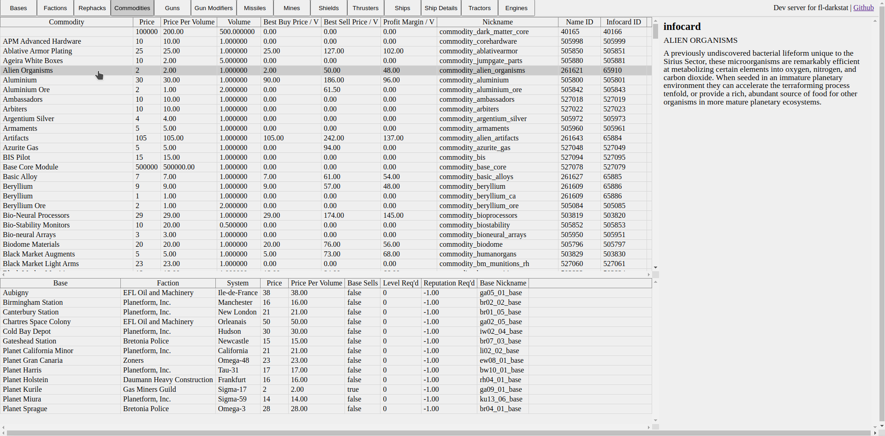

# Description

online version of the [flstat](https://discoverygc.com/forums/showthread.php?tid=115254) to navigate game data of [the game Freelancer](https://youtu.be/RHlH_qOH5zc). You can see data about Bases, Guns, Ships and multiple other stuff.

See demos:

- [development version](https://darklab8.github.io/fl-darkstat/)
- [Freelancer Discovery version](https://darklab8.github.io/fl-data-discovery/)
- [Freelancer Vanilla version](https://darklab8.github.io/fl-data-vanilla/)

# Support

- It was made in mind with supporting [Freelancer Discovery](https://discoverygc.com/) as first order.
- Support is extended to Vanilla version.
- Any other mode will be supported on request, see contacts to get in touch.

# Development setup

- git clone https://github.com/darklab8/fl-configs repository for game configs scan, download it to same parent folder as this repository
- install [templ](https://templ.guide/quick-start/installation)

  - go install github.com/a-h/templ/cmd/templ@latest
  - check specific version in [go.mod](./go.mod)
  - In case of emergency we could use vendored in version perhaps
- check [environment variables to set](.vscode/settings.json)

  - set your own environment variable FLDARKSTAT_FREELANCER_FOLDER to Freelancer Folder
- install [Taskfile](https://taskfile.dev/usage/) and check [commands to run](Taskfile.yml)

  - run some command, for example `task web`
- if u wish access to `task dev:watch` that reloads running web server on file changes, then install `pip install watchdog[watchmedo]` and ensure `watchmedo` binary is available to `task dev:watch` command written [in Taskfile](Taskfile.yml)
- If u wish making changes fl-configs and having them right away reflected to fl-darkstat

  - `go work init ; go work use . ; go work use ../fl-configs`
  - initialize Go workspaces, and provide relative path to fl-configs
  - [go workspaces]([https://go.dev/doc/tutorial/workspaces](https://go.dev/doc/tutorial/workspaces)) allow developing libraries code with real time update of usage to another repository
- All dependencies are vendored in with [go mod vendor](https://go.dev/ref/mod#go-mod-vendor) to [vendor folder](https://go.dev/ref/mod#go-mod-vendor) for long term maintanance purposes. We need to to run `go mod vendor` command after library updates for auto refreshing them. Vendored dependencies serve as backup in case of some libs dissapearings.

If u have problems with configuring development environment, then seek my contacts below to help you through it ^_^

# Features

- Long term maintance support for dozen of years. Minimum dependencies software with Golang and Htmx.
  - for this purpose everything is [go mod vendored in](https://go.dev/ref/mod#go-mod-vendor)
- full GitOps. On commit push to redeploy it automatically
  - See example in [fl-data-discovery repo](https://github.com/darklab8/fl-data-discovery). It contains .github/workflows + game data
- scans Freelancer folder and builds to static assets (html/css/js) deployable to Github pages or any other static assets serving place.
- Usable locally for Linux and Windows.
- Only Freelancer Discovery mod is supported at the moment

# What makes different from regular flstat

- Obviously online
- i also added at last Commodities view with prices per volume ^_^ better reflecting situation for Freelancer Discovery.
- It is interesting to see in Ship details exact Hp Types of equipment you can install onto ship. Other tabs like Guns, Shields, Engines show those Hp Type, so u could find equipment exactly supported for your Light Fighter, Heavy Fighter, Gunboat, Cruser or whatever (u can sort by column to find all such equipment)
- Tractors tab has info regarding Discovery IDs and where to buy them ^_^
- other extra tabs like Engines, CMs added
- Tabs for different equipment could be showing more full list of equipment in "Show all" mode.
- Has searching/filtering options with multiple matching items shown
- You can pin items for comparison
- For Discovery Freelancer, u can select ID/Tractor and having guns/ships etc filtered/shown according to what your ID can use without power core regeneration debuffs. Shows ID compatibility (75% ID compatibility at any equiped item will mean having only 75% of Power core regeneration)

# Usage locally

- download latest in [releases](https://github.com/darklab8/fl-darkstat/releases) appropriate for your OS and CPU architecture.
- put file into root of Freelancer folder and start
- visit http://localhost:8000/ as printed in console to see web site locally

# Acknowledments

- The tool was strongly inspired by [flstat](https://discoverygc.com/forums/showthread.php?tid=115254) originally written by Dan Tascau
  - regretfully original code was not found
  - some things helped from [patch written in Assembly to flstat](http://adoxa.altervista.org/freelancer/tools.html) by Adoxa
- In general a lot of stuff was checked from [Starport wiki](https://the-starport.com/wiki/)
  - [Bribing probabilities](https://the-starport.com/forums/topic/5372/bribe-probabilities/6?topic_id=5565) were inspired by Adoxa conversation at Starport in 2014
  - Also stuff like [market stuff](https://the-starport.com/wiki/ini-editing/typed-inis/markets/) page helped too
- Formulas for angular stuff were found in [flint](https://github.com/biqqles/flint/blob/master/flint/entities/ship.py#L82)
- [Discord Community in starport](https://discord.gg/freelancer-galactic-community-638984923591737355) also answered multiple questions
  - as well as Freelancer Discovery dev community
- Also thanks to The Alex (From Freelancer Discovery) for getting me [Python script for reading dlls](https://github.com/darklab8/fl-configs/blob/master/docs/inspiration/dll_reading/alex_py/main.py)
  - That helped rewriting it in go for [fl-configs lib](https://github.com/darklab8/fl-configs)
- Honorary mentions for very active moral support and extra ideas by
  - IrateRedKite (from starport Discord)
  - Bolte (from starport Discord)

<!--- 
- In case it will be ever needed, [just in case linking flcompanion](<https://github.com/Corran-Raisu/FLCompanion>)
- check Selfpatch for fl-data-discovery later https://github.com/Lazrius/DSLauncher/tree/default/Self%20Patch
-->

# Contacts

- discord DM: darkwind8
- discord server lab: https://discord.gg/aukHmTK82J
- or open [Pull Request here](https://github.com/darklab8/fl-darkstat/issues) and write there

See anouncements at [Discovery Freelancer forum thread](https://discoverygc.com/forums/showthread.php?tid=187294)
