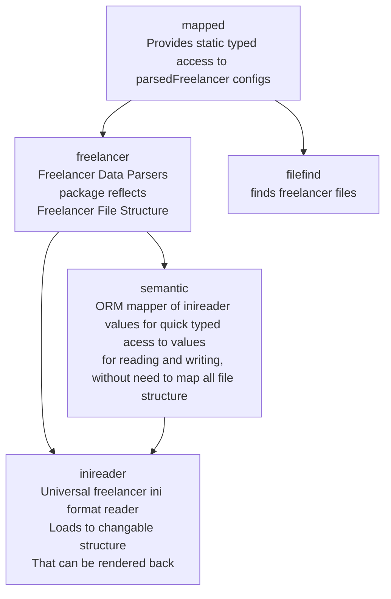

# fl-configs

## Description

Reusable library parser of Freelancer Discovery game data.

freelancer (resembling ini) config reader/writer with having mapped variables to access in ORM - object relational mapping fashion.
This alone allows quickly accessing any config data with least amont of code effort for additional features.

# Features

- it offers custom ORM like static typed access to data.
- With ability to read and write data back without requiring to write code for writing
  - U can be just changing ORM mapped values

This library is used at least in projects:

- fldarklint (config formatter)
- fldarkstat (online flstat)

# Code examples.

- see [configs folders](configs/) for example_ prefixed files like
  - [how to export data](configs/example_export_test.go)
  - [how to modify configs](configs/example_modifying_data_test.go)
- [Or see here if godocs already rescaned repo](https://pkg.go.dev/github.com/darklab8/fl-darkstat/configs)

## Architecture

# License

fl-configs was originally created by Andrei Novoselov (aka darkwind, aka dd84ai)
The work is released under AGPL license, free to modify, copy and etc. as long as you keep code open source and mentioned original author.
See [LICENSE](./LICENSE) file for details.
